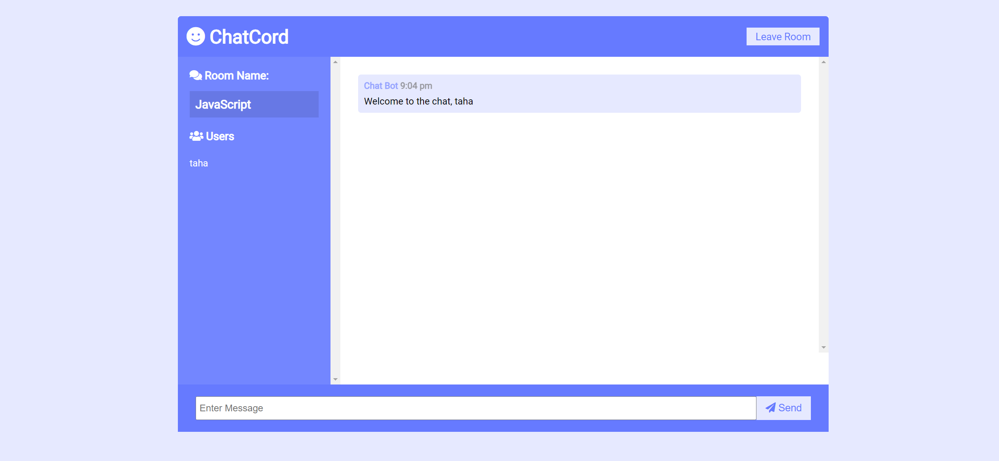

# Simple Chatroom App

This is a simple chatroom application built using Node.js, HTML/CSS, and Socket.io. It allows users to join chatrooms and exchange messages in real-time also having fun together 😉 .




## Features

- Real-time messaging: Messages are sent and received instantly using Socket.io.
- Multiple chatrooms: Users can join different chatrooms and have separate conversations.
- Simple and intuitive UI: The user interface is designed for ease of use.

## Prerequisites

Make sure you have Node.js and npm installed on your machine.

- [Node.js](https://nodejs.org/)
- [npm](https://www.npmjs.com/)

## Installation

1. Clone the repository:

   ```bash
   git clone https://github.com/tahaontech/simple_chatroom.git
   ```

2. Navigate to the project directory:

   ```bash
   cd simple_chatroom
   ```

3. Install dependencies:

   ```bash
   npm install
   ```

## Usage

### Run the app

To start the server, run:

```bash
npm run start
```

The application will be accessible at `http://localhost:3000` by default.

### Development mode

If you want to run the app in development mode with automatic reloading, use:

```bash
npm run dev
```

## Configuration

You can customize the app by modifying the configuration in the `.env` file.

- `PORT`: The port on which the server will run.
- `MAX_USERS_PER_ROOM`: Maximum number of users allowed in a chatroom. (TODO)

## Dependencies

- [Express](https://expressjs.com/): Web framework for Node.js.
- [Socket.io](https://socket.io/): Real-time bidirectional event-based communication.

## Contributing

Feel free to contribute to the development of this chatroom app. Please follow the [contribution guidelines](CONTRIBUTING.md).

## License

This project is licensed under the [MIT License](LICENSE).